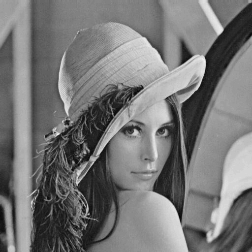
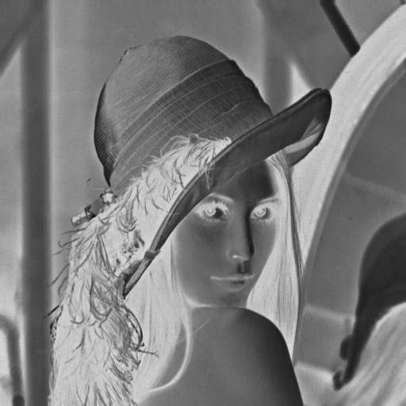
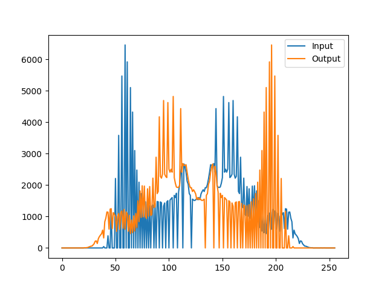
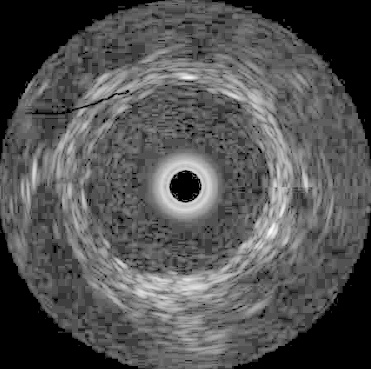
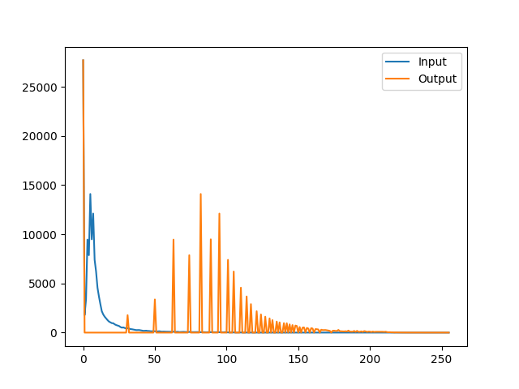
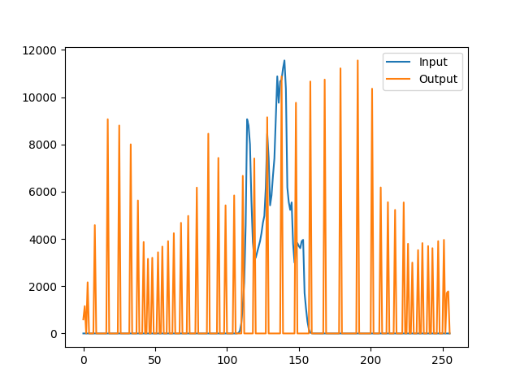
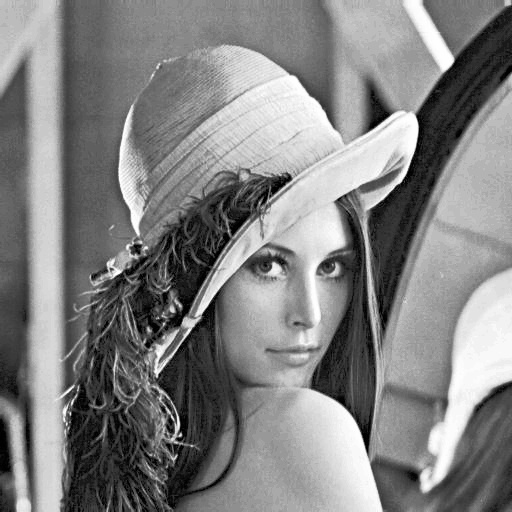
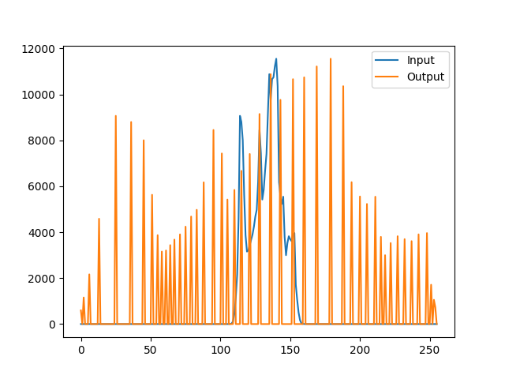
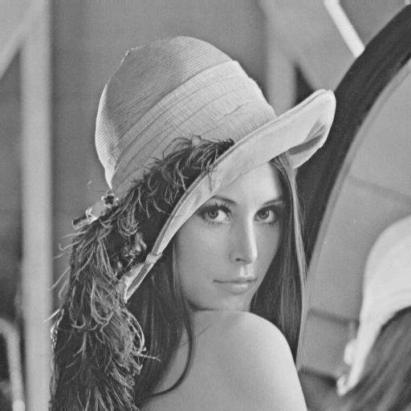
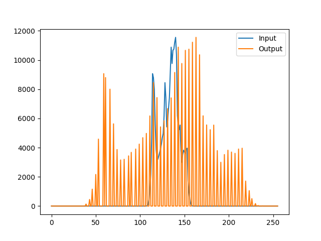

# 📊 PixelIntensityTransformations – Linear & Non-Linear Grayscale Mapping in Pure Python

PixelIntensityTransformations is a Python project focused on transforming grayscale images through a variety of **point-wise operations**, including both linear adjustments and non-linear histogram-based techniques. All transformations are implemented from scratch, without OpenCV or NumPy.

---

## 🔧 Features

### 🔸 Linear Point Operations
- **Linear Transformation**  
  Adjusts pixel values with the formula: `output = scale * input + shift`
- **Image Negative**  
  Inverts grayscale intensity values
- **Full Contrast Stretch**  
  Spreads pixel intensities across the full 0–255 range

### 🔹 Non-Linear Point Operations
- **Logarithmic Transform**  
  Enhances low-intensity details using log scaling
- **Histogram Flattening**  
  Equalizes the histogram for improved contrast
- **Histogram Shaping**  
  Transforms the histogram to match a desired distribution
- **Histogram Matching**  
  Matches the histogram of one image to a target image

---

## 📂 Project Structure

```
PixelIntensityTransformations/
├── pointops/
│   ├── linearpointops.py           # Linear transformations
│   └── nonlinearpointops.py        # Non-linear and histogram techniques
├── output/                         # Output images and histograms
├── samples/                        # Input and example images
├── run_pointops.py                 # Main runner script
├── dip.py                          # Provided utility code
├── requirements.txt
└── README.md
```

---

## 📸 Example Outputs

| Operation             | Image Output                         | Histogram                          |
|----------------------|---------------------------------------|-------------------------------------|
| Contrast Stretch      |                 |     |
| Image Negative        |      |  |
| Log Transform         |       |  |
| Histogram Flattening  |          |  |
| Histogram Shaping     |      |  |
| Histogram Matching    |     |  |


## ▶️ How to Run

```bash
# Example: Run linear point operation with scale=0.75 and shift=20
python run_pointops.py -p 0.75 -l 20
```

All output images and their histograms will be saved to the `output/` folder.

---

## ✅ Tech Stack

- Python 3
- Core modules only (`math`, `argparse`)
- No third-party libraries

---

## 💡 What It Demonstrates

- Point-wise transformations on grayscale images
- Contrast manipulation using both linear and non-linear methods
- Histogram analysis and shape manipulation
- Hands-on understanding of pixel-level image processing

